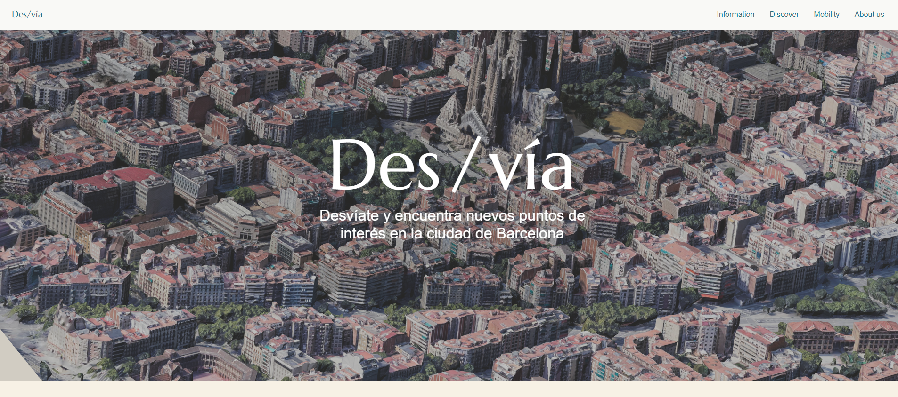

# Des/Via - Sustainable Tourism in Barcelona
***

## Des/Via is a project developed during a Hackathon with the aim of promoting sustainable tourism in the city of Barcelona, aligned with Sustainable Development Goal (SDG) number 11: Sustainable Cities and Communities: https://t.ly/sxp5Y

## Table of Contents
***
1. [Description](#description)
2. [Technologies](#technologies)
3. [Organization](#organization)
4. [Conclusions](#conclusions)
4. [Contributors](#Contributors)

### Description
***
Des/Via is a web application that addresses the issue of tourism in Barcelona and proposes a solution to decongest popular tourist sites while attracting visitors to areas with lower tourist activity. The proposal involves displaying information about the state of tourism in the city and presenting cultural points of interest on an interactive map, which are located in zones with low tourist intensity.
The information about the cultural points of interest is obtained from an Open Data CSV file and is correlated with a tourist intensity heat map of Barcelona, generated from a GPKG file of coordinates also extracted from Open Data. The points of interest are classified into five categories, where category 1 represents those located in zones with low tourist intensity, and category 5 corresponds to those with higher intensity.

### Screenshot
***

### Technologies
***
The project development utilized the following technologies:
* Data Science:
    * Python
    * Pandas
    * GeoPandas
    * Matplotlib
    * MySQL
    * Jupyter Notebook
* Backend
    * Java 17
    * Spring Boot 3
    * Intellij IDEA
    * OpenAPI V3 (Swagger)
    * Testing: JUnit + Mockito (in progress)
* Frontend
    * ReactJS
    * ThreeJS
    * React Icons
    * Chart JS
    * React Lazy Load
    * API Google Maps
    * Tailwind CSS / Daisy UI

### Organization
***
The Agile Scrum methodology was applied during the project development. The following organization process was followed:
* Initial meeting to establish project goals and scope.
* Development of the Minimum Viable Product (MVP).
* Task division and assignment to team members.
* Regular follow-up meetings every 1.5 hours to assess progress and address any issues.
* Final meeting to review the outcomes and evaluate the success of the project.

### Conclusions
***
The Des/Via project demonstrated good organization and coordination during development, successfully achieving the proposed MVP. However, there are areas for improvement in future versions, including:
* Generation of routes between points of interest.
* Implementation of a user rating system.
* Scalability to incorporate additional cities.
* Support for multiple languages.
* Enhancements to the responsive version of the website.

### Contributors
***
Meet the Winning Team! Together, we triumphed at Tech4Good Hackathon, bringing our diverse skills and expertise to create something incredible.

* Data Science:
    * [Laia Gómez Messía](https://www.linkedin.com/in/laiagomezmessia/)
    * [Jairo Villarroel Rodriguez](https://www.linkedin.com/in/jairo-villarroel-rodriguez/)
    * [Ivan Ariza Huertas](https://www.linkedin.com/in/ivan-ariza-huertas-94346b263/)
* Backend
    * [Dario Rucker](https://www.linkedin.com/in/dariorucker/)
    * [Carla Blasco Vidal](https://www.linkedin.com/in/carla-blasco-vidal/)
* Frontend
    * [Elionor Vendrell](https://www.linkedin.com/in/elionor/)
    * [Kevin Caeyman](https://www.linkedin.com/in/kevin-caeyman-5950a3109/)
    * [Marc Morado Paris](https://www.linkedin.com/in/marc-morado/)

***
